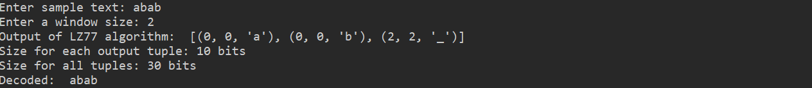
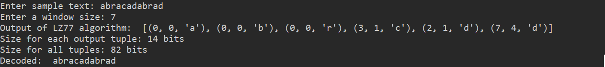

# LZ77
LZ77 algorithm for compression and decompression

## Compress function
The `compress()` function receives the **text** and a **window size** as parameters. It goes through the text character by character. In each iteration, the **search window** is updated and the longest **prefix** that can match is checked, saving the hits in the matches variable. Depending on the result of this variable, the components of the output tuples are configured.
When there are hits, the prefix that is stored in the variable is the one that doesn't match, so it is taken into account and the last character is removed when configuring the output. Also when there are hits, the corresponding iterations are skipped.

## Decompress function
The `decompress()` function receives as a parameter the output (**list of tuples**) of the `compress()` function. It loops through the tuples and concatenates the characters to an empty string. If it finds an offset of 0, it simply adds the character indicated in the symbol, if not, it copies the corresponding characters according to the offset and the number of hits.

## Test examples
In test.py the `test()` function checks that the original text is the same as the uncompressed one.
This LZ77 code is implemented for not very long texts, so the input text is entered by keyboard, as well as the window size. The list of compressed tuples, the number of bits they would occupy and the decompressed text are printed on the screen.

2 examples:

